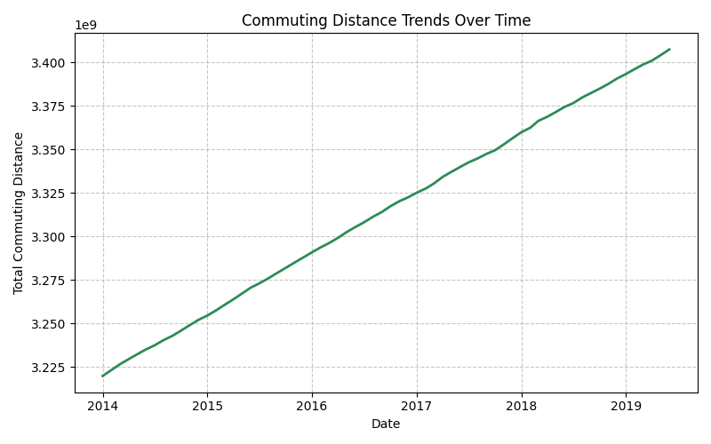
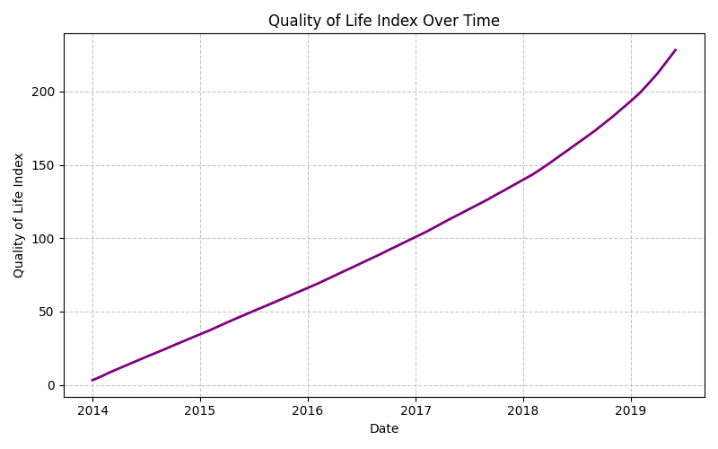
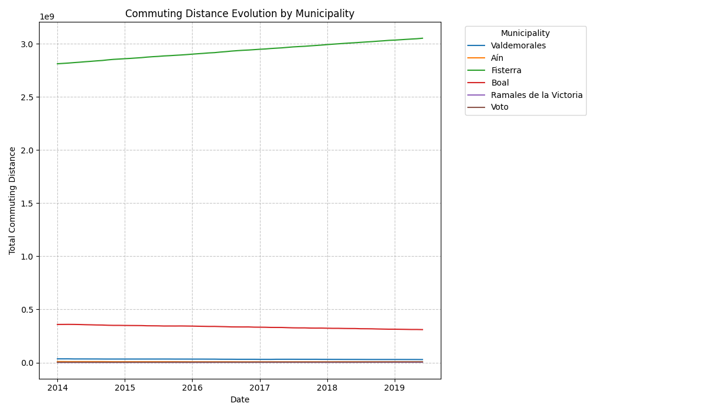
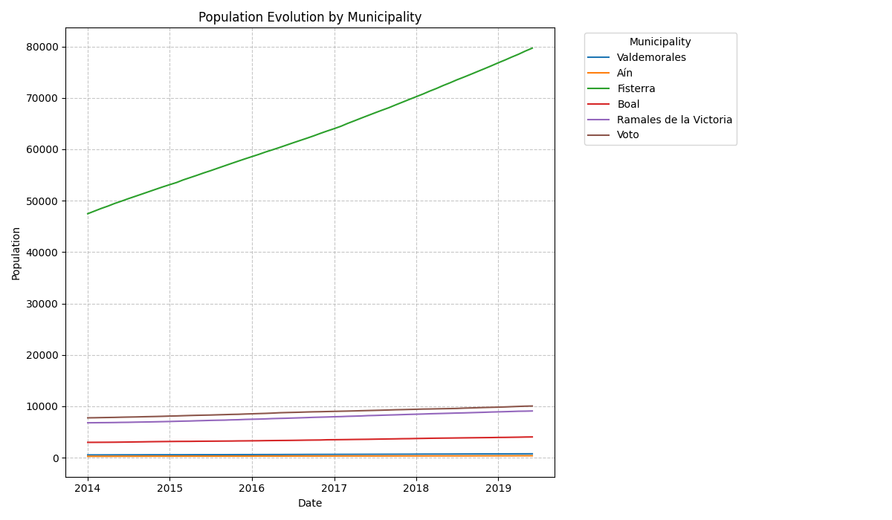
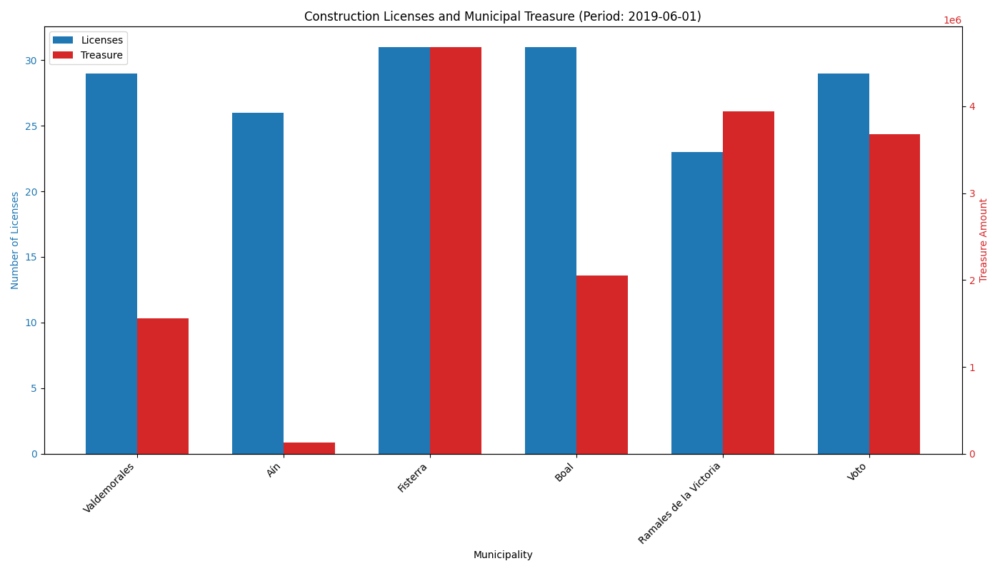
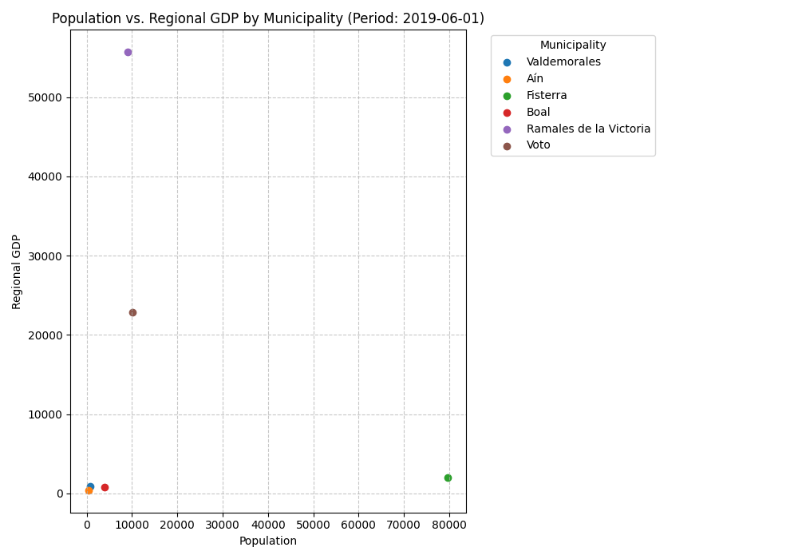
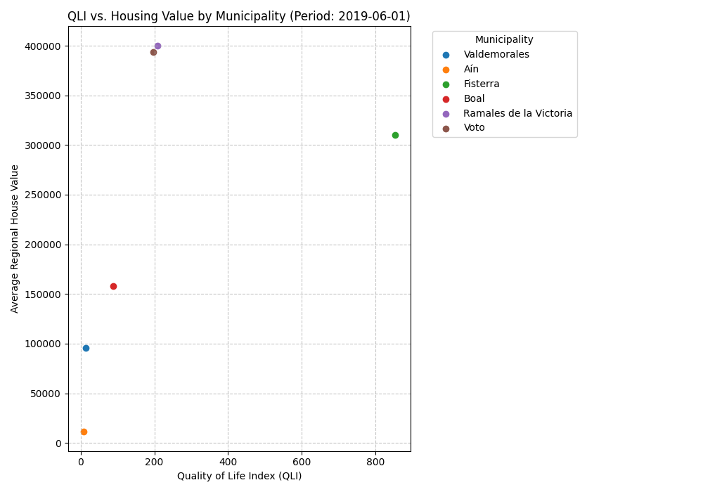

# Informe de Resultados de la Simulación (Ejecución: run__2025-05-29T17_02_05.507260)

Este informe resume los principales resultados visualizados a partir de la ejecución de la simulación del 2025-05-29.

## 1. Tendencias Generales Agregadas

Estos gráficos muestran la evolución de indicadores clave a nivel agregado para toda la simulación.

### 1.1. Tendencia de la Distancia Total de Commuting

*Descripción:* Este gráfico muestra la evolución de la distancia total de commuting acumulada por todos los agentes a lo largo del tiempo.
*Observación:* Se observa una tendencia general creciente en la distancia total de commuting, lo que podría indicar una expansión urbana o una mayor dispersión entre los lugares de residencia y trabajo.

### 1.2. Tendencia del Índice de Gini (Desigualdad General)

*Descripción:* Evolución del índice de Gini, que mide la desigualdad de riqueza o ingresos a nivel general. Un valor de 0 representa igualdad perfecta y valores mayores indican mayor desigualdad.
*Observación:* El índice de Gini muestra una estabilidad inicial y luego una volatilidad significativa alrededor de 2016-2017, con picos y valles pronunciados. Posteriormente, parece estabilizarse en un nivel ligeramente negativo, lo cual es inusual ya que el Gini típicamente varía entre 0 y 1. Esto podría indicar un artefacto en el cálculo o una situación económica particular en la simulación que requiere una investigación más profunda de la métrica.

### 1.3. Tendencia del Índice de Calidad de Vida (QLI)

*Descripción:* Muestra la evolución del promedio del Índice de Calidad de Vida (QLI) para todos los agentes.
*Observación:* El QLI general muestra un crecimiento constante y significativo a lo largo del periodo simulado, sugiriendo una mejora progresiva en las condiciones de vida promedio.

### 1.4. Tendencia del Precio Medio de Alquiler

*Descripción:* Evolución del precio medio de alquiler en el mercado.
*Observación:* El precio medio del alquiler inicialmente disminuye de forma pronunciada hasta aproximadamente 2018, donde alcanza un mínimo, y luego comienza una tendencia ascendente.

### 1.5. Tendencia de la Tasa de Desempleo General

*Descripción:* Evolución de la tasa de desempleo agregada.
*Observación:* La tasa de desempleo muestra un incremento constante y gradual a lo largo de toda la simulación.

## 2. Análisis a Nivel Municipal

Estos gráficos detallan la evolución y comparación de indicadores entre los diferentes municipios simulados. Los municipios simulados son: Valdemorales, Aín, Fisterra, Boal, Ramales de la Victoria, y Voto.

### 2.1. Evolución del Precio de Venta de Viviendas por Municipio

*Descripción:* Compara la evolución del precio medio de venta de viviendas en cada uno de los municipios.
*Observación:* Se observan dinámicas de precios muy diferentes entre municipios. "Fisterra" muestra un crecimiento exponencial y una volatilidad muy alta en sus precios, alcanzando valores significativamente más altos que el resto. "Voto" y "Ramales de la Victoria" también muestran un crecimiento considerable, aunque más estable. "Valdemorales", "Aín" y "Boal" mantienen precios mucho más bajos y con menor crecimiento. La volatilidad en Fisterra podría indicar un mercado pequeño o eventos específicos en la simulación.

### 2.2. Evolución de la Distancia de Commuting por Municipio

*Descripción:* Muestra la evolución de la distancia total de commuting para cada municipio.
*Observación:* "Fisterra" domina ampliamente en términos de distancia total de commuting, con una tendencia creciente. Los demás municipios muestran niveles de commuting mucho más bajos y relativamente estables.

### 2.3. Evolución del PIB per Cápita por Municipio

*Descripción:* Compara la evolución del Producto Interior Bruto per cápita en cada municipio.
*Observación:* "Voto" destaca con un PIB per cápita significativamente más alto y volátil que los demás municipios, mostrando picos pronunciados. El resto de los municipios presentan niveles más bajos y con fluctuaciones menos marcadas.

### 2.4. Evolución de la Tasa de Desempleo por Municipio

*Descripción:* Muestra la evolución de la tasa de desempleo para cada municipio.
*Observación:* Todos los municipios muestran una tendencia general al alza en la tasa de desempleo. "Fisterra" parece tener consistentemente la tasa más alta, mientras que "Valdemorales" y "Aín" comienzan con las tasas más bajas, aunque también crecen.

### 2.5. Evolución del Índice de Gini Regional por Municipio

*Descripción:* Compara la evolución de la desigualdad de ingresos (medida por el índice Gini) dentro de cada municipio.
*Observación:* La mayoría de los municipios mantienen un índice Gini cercano a cero durante gran parte de la simulación. Sin embargo, "Boal" experimenta una volatilidad extrema en su índice Gini hacia el final del periodo, con valores tanto muy positivos como muy negativos, lo que sugiere cambios drásticos en la distribución de ingresos o posibles problemas en la métrica para este municipio en particular.

### 2.6. Evolución de la Población por Municipio

*Descripción:* Muestra cómo evoluciona la población en cada uno de los municipios.
*Observación:* "Fisterra" tiene una población significativamente mayor que el resto y muestra un crecimiento constante. Los demás municipios tienen poblaciones mucho menores y relativamente estables, con ligero crecimiento en algunos como "Voto".

## 3. Comparativas Puntuales (Último Periodo: 2019-06-01)

Estos gráficos ofrecen una instantánea de diferentes métricas en el último periodo registrado de la simulación.

### 3.1. Comparativa de Licencias de Construcción y Tesorería Municipal

*Descripción:* Gráfico de barras que compara el número de licencias de construcción emitidas (eje izquierdo, azul) y el montante de la tesorería municipal (eje derecho, rojo) para cada municipio en el último periodo.
*Observación:* "Fisterra" y "Boal" muestran el mayor número de licencias. En cuanto a tesorería, "Fisterra" también lidera, seguida de "Ramales de la Victoria" y "Voto". "Aín" presenta los valores más bajos en ambas métricas.

### 3.2. Relación Población vs. PIB Regional

*Descripción:* Diagrama de dispersión que relaciona la población de cada municipio con su PIB regional en el último periodo.
*Observación:* "Fisterra" se destaca por tener la mayor población y también un PIB regional considerable. "Voto", a pesar de tener una población mucho menor, presenta un PIB regional relativamente alto en comparación con otros municipios de tamaño similar.

### 3.3. Relación QLI vs. Valor Medio de Vivienda Regional

*Descripción:* Diagrama de dispersión que relaciona el Índice de Calidad de Vida (QLI) con el valor medio de la vivienda a nivel regional para cada municipio en el último periodo.
*Observación:* "Fisterra" muestra el QLI más alto y también el valor de vivienda más elevado. "Voto" también tiene un QLI alto con un valor de vivienda moderado. Otros municipios se agrupan con QLI y valores de vivienda más bajos.

## 4. Mapas Coropléticos (Último Periodo)

Estos mapas muestran la distribución geográfica de ciertas métricas.

### 4.1. Mapa de Precios Medios de Vivienda (Estático)

*Descripción:* Mapa coroplético estático mostrando el precio medio de la vivienda por municipio en el último año (2019).
*Observación:* Este mapa parece tener problemas de visualización o escala, ya que los municipios no se colorean claramente según la leyenda de precios. La mayoría aparecen con el color más bajo de la escala.

### 4.2. Mapa del Índice de Calidad de Vida (QLI) (Estático)

*Descripción:* Mapa coroplético estático mostrando el Índice de Calidad de Vida (QLI) por municipio en el último año (2019).
*Observación:* Similar al mapa de precios, este mapa también presenta dificultades para distinguir variaciones entre municipios basados en la leyenda de color.

### 4.3. Mapa Interactivo del Índice de Calidad de Vida (QLI)
Se generó también un mapa interactivo: `municipal_map_interactive_QLI.html`. Este archivo permite una exploración más detallada.
*(Nota: La efectividad de este mapa interactivo depende de si los datos se vincularon correctamente a las geometrías, lo cual fue un punto de revisión.)*

## Conclusiones Generales (Preliminares)

La simulación muestra tendencias de crecimiento en variables agregadas como la distancia de commuting, el QLI y el desempleo, mientras que el precio del alquiler tiene un comportamiento en forma de U. El índice Gini general presenta una volatilidad que merece ser investigada.

A nivel municipal, existen disparidades significativas:
*   **Fisterra** emerge como un municipio con alta población, alto commuting, precios de vivienda muy elevados y volátiles, y la tasa de desempleo más alta.
*   **Voto** destaca por su alto PIB per cápita.
*   **Boal** muestra una inestabilidad extrema en su índice Gini regional hacia el final.

Los mapas coropléticos estáticos no parecen representar claramente las diferencias, lo que podría deberse a la escala de colores o a la distribución de los datos. El mapa interactivo podría ofrecer mejor visualización si los datos se muestran correctamente.

Este análisis es preliminar y se basa en las visualizaciones generadas. Una investigación más profunda de los datos subyacentes y la configuración del modelo podría proporcionar explicaciones más detalladas para las tendencias observadas.
